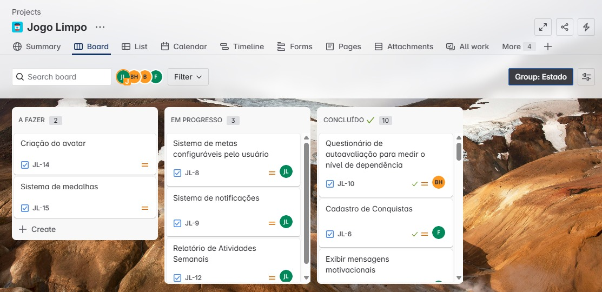

# Introdução

Informações básicas do projeto.

- **Projeto:** [Vício em jogos de azar]
- **Repositório GitHub:** [LINK PARA O REPOSITÓRIO NO GITHUB](https://github.com/ICEI-PUC-Minas-PPLCC-TI/atividade-01-ti-vicio-em-jogos-de-azar)
- **Membros da equipe:**

  - [Bernardo Barbosa Heronville](https://github.com/bernardoheronville) 
  - [Janielly Lorene Talini dos Santos](https://github.com/Janilorene)

A documentação do projeto é estruturada da seguinte forma:

1. Introdução
2. Contexto
3. Product Discovery
4. Product Design
5. Metodologia
6. Solução
7. Referências Bibliográficas

✅ [Documentação de Design Thinking (MIRO)](https://miro.com/app/board/uXjVIM4AbH4=/?share_link_id=498162005853)

# Contexto

O vício em jogos de azar, também conhecido como transtorno do jogo, é um problema de saúde pública crescente com sérias consequências para indivíduos, famílias e sociedade. A facilidade de acesso a jogos online e presenciais, aliada a
fatores psicológicos e sociais, contribui para a proliferação dessa condição. 
Este projeto propõe o desenvolvimento de um aplicativo Web abrangente para fornecer informações, ferramentas de autoavaliação, recursos de apoio e conexão com profissionais e grupos de ajuda, visando auxiliar na prevenção, identificação precoce e tratamento do vício em jogos de azar.

## Problema

O problema que o grupo busca resolver é o vício em jogos de azar, um transtorno que, segundo a Universidade de São Paulo, afeta cerca de 2 milhões de pessoas no Brasil.
A principal dor vivida por quem sofre desse vício é a perda de controle sobre os impulsos relacionados ao jogo, levando a consequências como dívidas financeiras, problemas em relacionamentos pessoais, problemas de saúde mental e até mesmo isolamento social. O individuo não consegue parar de jogar e desenvolve um comportamento compulsivo que os leva a apostar quantias cada vez maiores em busca da sensação de recompensa do ganho.
O cenário brasileiro das apostas é influenciado por fatores como o aumento da publicidade agressiva de plataformas de apostas esportivas, que têm forte presença em eventos esportivos, redes sociais e na televisão. Além disso, a regulamentação ainda em desenvolvimento cria um cenário de fácil acesso aos jogos, sem uma estrutura sólida de prevenção e apoio ao tratamento da ludopatia (vício em jogos).

## Objetivos

O objetivo geral é desenvolver um software que ajude a solucionar o problema de vício em jogos de azar.
O sistema desenvolvido deve ser capaz de ajudar as pessoas a controlar seus impulsos relacionados aos jogos de azar
Também deve ser capaz de propor uma forma de substituir os jogos por atividades mais saudáveis utilizando ferramentas de recompensa
Além disso, deve ser capaz de fornecer um ambiente de apoio ao usuário onde eles podem compartilhar experiências.

## Justificativa

Ao auxiliar indivíduos e famílias afetadas, o aplicativo pode contribuir para a redução das consequências negativas do vício em jogos de azar na sociedade. Os usuários vão poder acessar o aplicativo a qualquer hora e em qualquer lugar, no seu próprio ritmo, adaptando o uso às suas necessidades e horários.

## Público-Alvo

Indivíduos que suspeitam ter um problema com jogos de azar: Pessoas que reconhecem dificuldades em controlar seus hábitos de jogo, que estão experimentando consequências negativas ou que desejam avaliar seu nível de envolvimento.
Indivíduos diagnosticados com transtorno do jogo: Pessoas que estão em processo de tratamento ou recuperação e que buscam recursos adicionais de apoio e autogestão.

# Product Discovery

## Etapa de Entendimento

### Mapa de Stakeholders

### Entrevistas qualitativas

### Highlight de pesquisa

## Etapa de Definição

### Personas

#### Gabriel

#### Roberto

#### Paulo

# Product Design

Nesse momento, vamos transformar os insights e validações obtidos em soluções tangíveis e utilizáveis. Essa fase envolve a definição de uma proposta de valor, detalhando a prioridade de cada ideia e a consequente criação de wireframes, mockups e protótipos de alta fidelidade, que detalham a interface e a experiência do usuário.

## Histórias de Usuários

Com base na análise das personas foram identificadas as seguintes histórias de usuários:

| EU COMO...`PERSONA`                                  | QUERO/PRECISO ...`FUNCIONALIDADE`                         | PARA ...`MOTIVO/VALOR`               |
| ---------------------                                | ------------------------------------------                | -------------------------------------- |
| Usuário com problemas de vício em jogos de azar      | Ferramenta que forneça um meio de controlar os meus gastos | Poder economizar meu dinheiro e não contrair dívidas|
| Usuário que deseja superar o vício em jogos de azar  | Participar de um grupo de apoio comunitário no site       | Para compartilhar minhas experiências, ouvir os outros e me sentir apoiado durante o processo de recuperação|
| Dependende de jogos de azar                          |  Ferramentas e recursos para me ajudar a controlar meus impulsos e evitar jogar |  Conseguir me manter abstinente e reconstruir minha vida pessoal e financeira|
| Ex-jogador compulsivo em processo de recuperação     | Um grupo de apoio e estratégias para identificar e evitar gatilhos de recaída      | Me manter sóbrio e continuar construindo uma vida saudável longe dos jogos|
| Apostador compulsivo de apostas esportivas           | Um app para que ajude a controlar minha vontade excessiva de aposta    | Parar de gastar todo meu dinheiro|
| Ex-apostador                                         | Uma comunidade de dependentes e viciados       | Ajudar a conscientizar  e me autoajudar a nao voltar para as apostas |
| Possível novo apostador                              | Compreender os grandes malefícios  que o vício em apostas trás      |Desencorajar e conscientizar, sem que alimente o vício em momento algum |

## Proposta de Valor

### Proposta de valor para Persona 1

### Proposta de valor para Persona 2

### Proposta de valor para Persona 3

## Requisitos

As tabelas que se seguem apresentam os requisitos funcionais e não funcionais que detalham o escopo do projeto.

### Requisitos Funcionais

| ID     | Descrição do Requisito                                                         | Prioridade |
| ------ | ------------------------------------------------------------------------------ | ---------- |
| RF-001 | Sistema de recompensas baseado em atividades saudáveis                         | ALTA       |
| RF-002 | Sistema de grupo de apoio comunitário                                          | ALTA       |
| RF-003 | Exibir mensagens motivacionais                                                 | MÉDIA      |
| RF-004 | Permitir cadastro de usuário                                                   | ALTA       |
| RF-005 | Registro e exibição do tempo sem apostas                                       | ALTA       |
| RF-006 | Sistema de controle de gastos financeiros                                      | MÉDIA      |
| RF-007 | Sistema de metas configuráveis pelo usuário                                    | ALTA       |
| RF-008 | Questionário de autoavaliação para medir o nível de dependência                | MÉDIA      |
| RF-009 | Sistema de notificações                                                        | MÉDIA      |
| RF-010 | Mensagens motivacionais religiosas                                             | BAIXA      |

### Requisitos não Funcionais

| ID      | Descrição do Requisito                                                                                                       | Prioridade |
| ------- | ---------------------------------------------------------------------------------------------------------------------------- | ---------- |
| RNF-001 | O sistema deverá estar disponível 7/24 (7 dias por semana 24 horas por dia)                                                  | ALTA       |
| RNF-002 | Funcionar em outros dispositivos                                                                                             | ALTA       |
| RNF-003 | O sistema deve funcionar sem conexão constante à internet                                                                    | MÉDIA      |
| RNF-004 | O site deve ser responsivo, permitindo a visualização e interação adequada em dispositivos móveis                            | ALTA       |
| RNF-005 | O site deve ter uma interface intuitiva, com navegação fácil e design acessível para diferentes perfis de usuários           | ALTA       |
| RNF-006 | O sistema deve garantir que os dados dos usuários, como informações pessoais e de saúde, sejam criptografados e protegidos   | ALTA       |

## Projeto de Interface

Artefatos relacionados com a interface e a interacão do usuário na proposta de solução.

### Wireframes

Estes são os protótipos de telas do sistema.

### Conta

### Usuário

### Meta

### Atividades 

### Comunidade

### User Flow

### Protótipo Interativo

https://ninjamock.com/s/Z5987Lx

# Metodologia

Detalhes sobre a organização do grupo e o ferramental empregado.

## Ferramentas

Relação de ferramentas empregadas pelo grupo durante o projeto.

| Ambiente                    | Plataforma | Link de acesso                                                                                 |
| --------------------------- | ---------- | ---------------------------------------------------------------------------------------------- |
| Processo de Design Thinking | Miro       | https://miro.com/app/board/uXjVIM4AbH4=/?share_link_id=498162005853                            |
| Repositório de código       | GitHub     | https://github.com/ICEI-PUC-Minas-PPLCC-TI/atividade-01-ti-vicio-em-jogos-de-azar              |
| Wireframes e Userflow       | Figma      | https://www.figma.com/design/Eys5SnzzwlZBOF4Q5YzbXe/Userflow?node-id=0-1t=fyp79uJN0jLOluEW-1   |
| Protótipo Interativo        | NinjaMock  | https://ninjamock.com/s/Z5987Lx                                                                |

## Gerenciamento do Projeto

Divisão de papéis no grupo e apresentação da estrutura da ferramenta de controle de tarefas (Kanban).

# Tecnologias

Usamos as seguintes tecnologias e bibliotecas:

- [Bootstrap](https://getbootstrap.com/): Utilizado para estilização e layout da interface do usuário
- [jQuery](https://jquery.com/): Foi utilizado para a manipulação do DOM
- [JSON-Server](https://github.com/typicode/json-server#readme): Utilizado como servidor e banco de dados

# Referências

As referências utilizadas no trabalho foram:

BIERNATH, A. Bets e transtorno do jogo: o que acontece no cérebro de pessoas viciadas em apostas. BBC, 19 nov. 2024.

ALVES, B. /. O. /. Como as bets afetam a saúde mental dos brasileiros. Disponível em: <https://bvsms.saude.gov.br/como-as-bets-afetam-a-saude-mental-dos-brasileiros/>. Acesso em: 22 jun. 2025.

What is gambling disorder? Disponível em: <https://www.psychiatry.org/patients-families/gambling-disorder/what-is-gambling-disorder>. Acesso em: 22 jun. 2025.

MARQUETTO, R. A. Vício em jogo: sintomas, causas e tratamentos. Clínica Pontual, 13 maio 2024. Disponível em: <https://www.pontualpsiquiatria.com.br/post/vicio-em-jogo-sintomas-causas-e-tratamentos>. Acesso em: 22 jun. 2025
