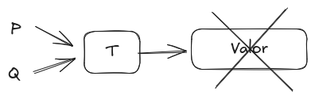
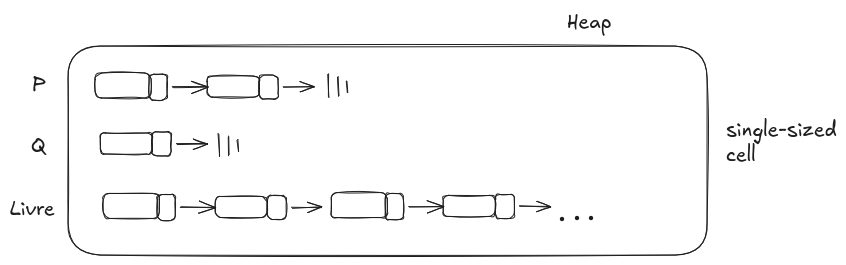
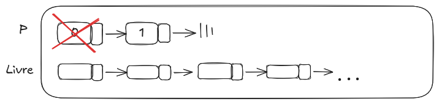
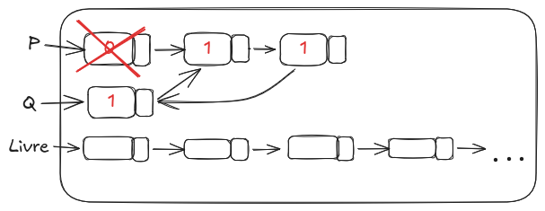
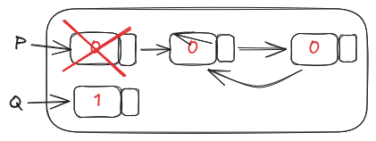

## 12/02 - 1.3
* Legibilidade: 
  * <1920: Pensando no PC
  * >1920: Legibilidade é o mais importante
* Domínio importa
  1. Simplicidade: + constructor =>
  - Legibilidade 
  - Multiplicidade: + de uma forma de obter o mesmo resultado
  - | count = count + 1; count++; ++count; count += 1;

## 10/03 - 6.5 - 6.6
* Vetor: Coleção homogênea de elementos os quais são identificados por seu indice/posição (relativa à do 1)
* Elementos são referenciados por meio de um mecanismo sintático de dois níveis
    * 1: Nome do vetor
    * 2: Seletor/Índice composto por 1 ou + itens 

        nome_vetor (seletor)&rarr; elemento
* Se as referências do seletor são constantes, então é estático. Senão, é dinâmico
* Categorias 
    * Estática: Tamanho e alocação
```c
char * msg = "Ola Mundo";
```
* Fixo e dinâmico em pilha: Tamanho estático Alocação dinâmica 
```c
char s[1024]; // em uma função
```
* Fixo e dinâmico em heap: Requisitado pelo usuário e feito em tempo de execução 
```c
| int *v = malloc(n * sizeof(int));
```
* Dinâmico em heap: A amarração é feita em tempo de execução e pode alterar durante a eecução
```c#
| List <String> s = new List<String>;
```
* Operações: Atribuição, Concatenação, Comparação e slices
* Retangular: Vetor multidimensional de tamanho regular
* Irregular: Vetor multidimensional cujo tamanho das linhas é diferente
* Slice: Sub estrutura do vetor. Não é um novo tipo mas uma referência 


* Multidimensionais p/ unidimensionais 
    * Row major order e Column major order

            location(a[i, j]) = &(a[raw_lb, col_lb]) - (((row_lb * n) + col_lb) * elem-size) + ((i * n) + j) + elem-size
    | Campo do Descritor ||
    | :--- | :--- |
    | **Mult. Array** |
    | **Elem. Type** |
    | **Index Type** |
    | **# Dimensions** |
    | **Index 0** |
    | **Index 1** |
    | **...** |
    | **Endereço** |
* Vetor associado: Coleção não ordenada de elementos indexados por valores chamado.
```c
| int *cpfs;
| float *notas;
| char **nome;
```
## 12/03 - Cap 6.7 - 6.10
* Registro: Coleção de dados no qual elementos individuais são referenciados por nomes e acessados via offset

        C: struct Aluno {
                int cpf;
                float nota;
                char *nome
           };
* Elementos não precisam ser do mesmo tipo e/ou tamanho

        |void **obj; // Não é registro
* No registro, os elementos ESTÂO contígidos na memória

        Aluno *a = new Aluno();
        // a ->cpf; a.cpf; Campo
* Fully qualified: Refefência a um campo explicitando todos os nomes intermediários

        | cout << curso[c].aluno[a].disciplica[d].nota[p1];
* Elliptical: O campo é nomeado, mas os nomes intermediários podem ser omitidos.

        | Disciplina *d = &(curso[c].aluno[a].disciplina[d]);
        | cout << d->nota[p1]; // NÃO É ELIPTICO
* 
    | Registro ||
    | :--- | :--- |
    | **Nome** |
    | **Tipo** |
    | **Offset** |
    | **Nome** |
    | **Tipo** |
    | **Offset** |
    | **...** |
    | **Endereço** |
* Tuplas: Similar à um registro, mas seus elementos não são nomeados

        | par = (100, 'maçã') # imutável
* Lista: 

        | lista = [3, 5.8, 'uva']

* List comprehension: Deriva da teoria de conjuntos uma função é aplicada a cada elementos, construindo um novo conjunto

```python
| [x * x for x in range(12) if x % 3 == 0]
| # [0,9,36,81]
```
* Union (Registro Variável): Tipos cujas variáveis podem ter valores de tipos de diferentes durante a execução do código

```c
| union pixel {
|        char b;
|        int i;
|        float f;
| };
| pixel p; p*b = 'A'; p.i = 1024;
| print("%c", p.b); // '\0'
```
* Free union: Programadores estão "livres" da verificaçao de tipos
* Discriminated union: Requer que cada registro variante inclua um tipo indicador (tag)

## 17/03 - Cap 6.11

* Ponteiros: Tipo cujos valores possíveis são endereços de memória ou um valor especial (Nulo)
* Endereçamento indireto e gerenciamento de memória dinâmica (heap)
* Variáveis anônimas: Variáveis não nomeadas
```c++ 
| int *v = new int[n];
| // Variável heap dinâmica
``` 
* Aumenta a redigibilidade
* Atribuição e Deferenciamento: 

1. Armazena o endereço de uma variável;
1. Referencia ao valor do endereço contido no ponteiro
```c
| //malloc e new; free e delete
| //&
| int &p, q; /* int p, q; */
| p = q; /* p = &q; */
```
* Ponteiro pendente: Contém o denreço de uma variável heap dinâmica já desalocada
```c++
| int *p1, *p2;
| p1 = new int[100];
| p2 = p1;
| delete[] p1;
```
* Vazamento de memória: Variável heap dinâmica que não é acessada pelo programa 
```c 
| int *p = malloc(sizeof(int));
| p = malloc(sizeof(int));
| void qsort(void* v, size_t n, size_t b, int(void*, void*)*f);
```
* Referência: Similar a ponteiro, mas referência um objeto ou valor na memória
```c++
| int r = 0;
| int &q = r;
| q = 100;
```
```c
void f(int &v){ v*=v;}
void f(int *v){*(v) *= (*v);}
//
f(x);
f(&x);
```
* Tombstones:
<center>
        
</center>

* Cada variável heap dinâmica possui uma célula adicional que é um ponteiro para o conteúdo da heap
* Quando desalocado, o tombstone é definido como nulo

+: Previne ponteiros pendentes 

-: Consome + memória e tempo
* Locks-and-keys: Ponteiros são representados como um par(key, endereço)
* Quando alocado, define-se um valor para o key do ponteiro e do conteúdo da heap
* Cópias  do ponterio devem ter a mesma key
* Quando desalocado, a Key do conteúdo é colocadda para um valor inválido
<center>
        
</center>

* Contagem de referências: 
<center>
        
</center>

```c
| int *p = malloc(sizeof(int));
| p = NULL;
```
* É executada toda vez que há desalocação ou alocação
<center>
        
</center>

* Marcar e varrer
<center>
        
</center>

* Só é executado quando a memória está cheia
* Opcionais: Tipos "especiais" que tem um valor "normal" e um outro "especial" para indicar que não existe valor
```C#
| int? x;
| if(x == null) {/*..*/}
| else {/*..*/}
```
## 19/03 - Cap 6.12 - 6.16
* Verificação de tipos: Tarefa de garantir que os operandos de um operador são compatíveis
* Coerção: Conversão implícita de um tipo para outro (legal) pelo compilador 
```c 
| float f = 3 * 15;
| char c = 'A' + 2;
```
* Estático vs Dinãmico

+: Confiabilidade e Otimizado

-: Flexibilidade
* Fortemente tipada: Sempre consegue verificar a existência de erros de tipo 
* &uarr;Coerção &darr;Fortemente tipada: Coerção plode levar à perda de acurácia no detecção
* Equivalentes: Quando é permitido trocar o tipo por outro sem coerção
```c
| struct A {int x, y;};
| struct B {int x, y;};
```
* Nome: São equivalentes se o tipo for o mesmo 
* Estrutura: São equivalente se possuírem a mesma estrutura
```Ada
| type i is 1..100;
| c : Integer;
| f : i;
```
* Estrutura é mais flexível que nome, mas tem dificuldade em diferenciar 
* Derivado: Tipo, baseado em outro, no qual pode ter a mesma estrutura, mas não é equivalente 
* Subtipo: Normalmente, é um tipo contido em um outro(ex: intervalo)
* Classe&rarr;Esquivalente de objetos
```Ada
| type deriv is new Integer 1..100;
| subtype sub is Integer 1..100;
```
## 24/03 - Cap 7.1 - 7.3
* Unária: !, ~, ++,--

  Binária: &, |, ^, +, -, /, *, >>, <<

  Ternária: ?
* a ? b, a ? b : c;
* Expressão: Conjunto de operadores e operações que resultam em um valor 
* Infixo: a + b
  
  Posfixa: ab + a++

  Prefixa: +ab, ++a
* (i): Buscar valores na memória 
  (ii): Cálculo
* Procedência: Ordem de avaliação da expressão
* while (t = t--) {/*...*/}
* ++, -- posfixo

  ++, --, prefixo, +, - unário

  *, /, %

  +, - binário
* Associatividade: Determina a ordem de avaliação dos operadores
* Esquerda: *, /, %, +, - binário
  Direita: ++, --,+, - unário
* Pode-se alterar a precedência e a associatividade utilizando parênteses
* Ordem de avaliação dos operandos
```c
| int a = 10;
| int b = a + f(&a);
```
* Efeito colateral: Ocorre quando a função altera um de seus parâmetros, ou uma variável global
* Soluções? Não permitir efeitos colaterais, definir uma ordem estrita de avaliação
* Transparência referencial: Se quaisquer duas expressões de mesmo valor possam ser trocadas sem afetar o programa  
```c
| r1 = (fun(a) + b) / (fun(a) + c);
| temp = fun(a);
| r2 = (temp + b) / (temp + c);
```
+: Otimização; Legibilidade; Sem efeito colateral(funcional)
* Sobrecarga: Uso multíplo de um operador 
* 'c' + 'a'

&rarr; "ca"

&rarr; (char) 99 + 97

* p && q != p & q

## 14/04 - Cap 8.1 - 8.2
* Estruturas / Comandos de controle: meios para alternar o fluxo do programa e / ou executar repetições de comandos
* Todos os algoritmos que conseguem ser descritos por meio de um fluxograma podem ser codificados com um tipo de comando de seleção e um tipo de comando de repetição
* Comando de seleção: Fornece os meios para selecionar entre dois ou mais caminhos na execução
* 2-way ou n-way
```c
| if expr then     if(sum == 0)
|    comandos         if(count == 0)
| else                  result = 0;
|    comandos      else
|                       result = 1;
```
* A semântica estática da linguagem especificam que a clausula else é sempre parada com o if mais próximo e seu respectivo then não pareado
* Desvantagem da regra: Impede o programador de determinar a cláusula if que estará pareada com o else
```C#
| let y = 
|    if x > 0 then x
|    else 2 * x;;
```
* Comando de seleção multipla: Permite a seleção de um dentre vários comandos
```C
| switch(expr) {
|       case constante: comandos; 
|
|       case constante: comando
|       [default: comando]
| }
```
* Break pode ser visto como um go to "limitado" e é utilizado para sair do switch, transferindo o fluxo para o controle associado
```html
| switch(X)
|  default:
|  if(prime(x))
|    case 2: case 3: case 5: case 7
|       process_prime(x);
|  else
|    case 4: case 6: case 8: case 9: case 10:
|       process_composite(x)
```